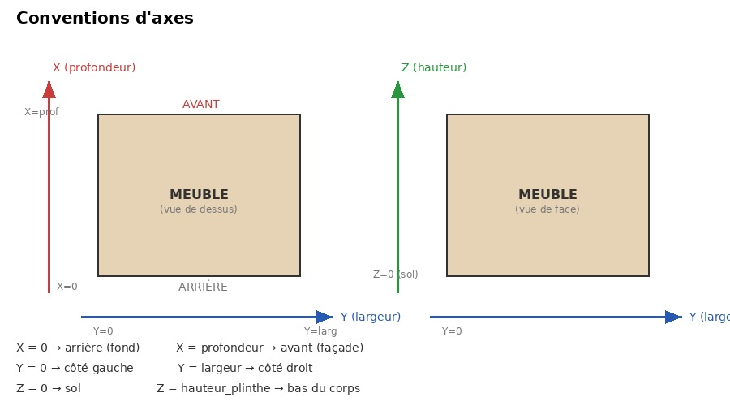
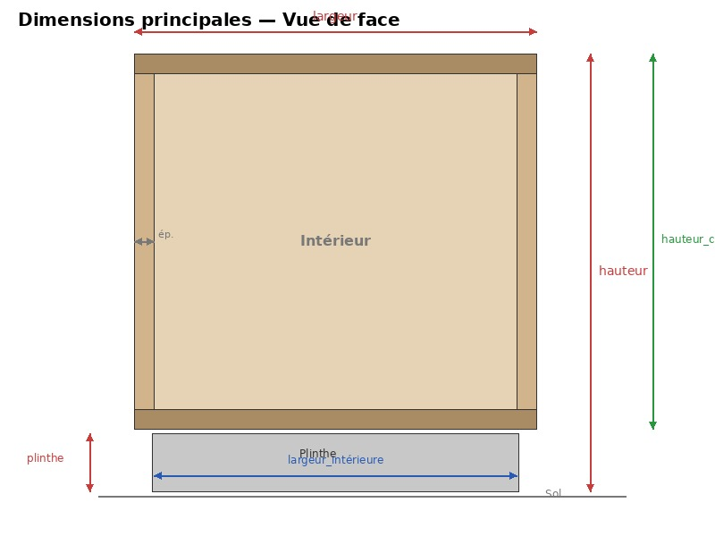
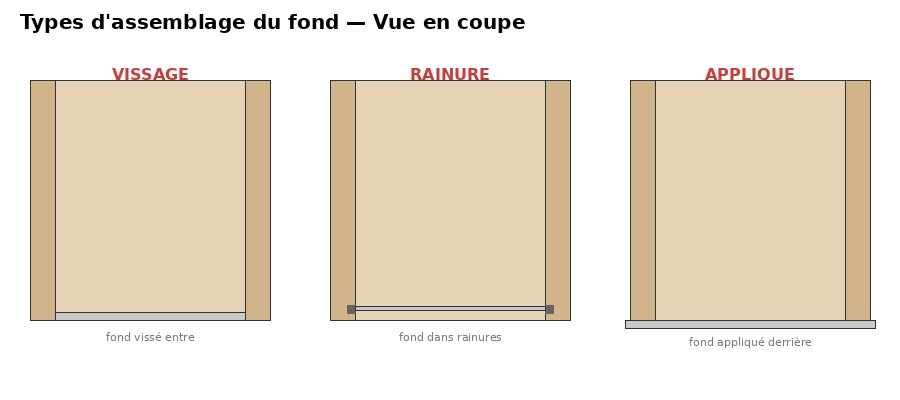
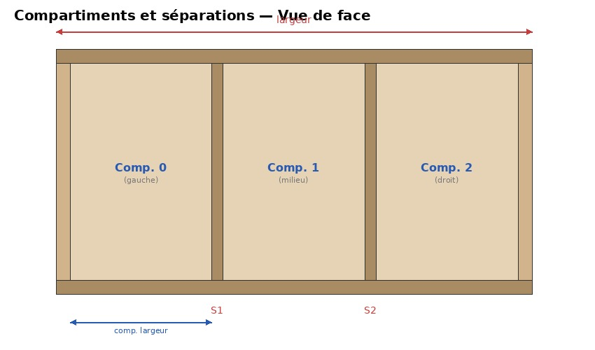
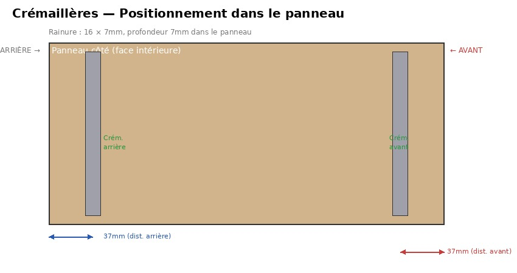
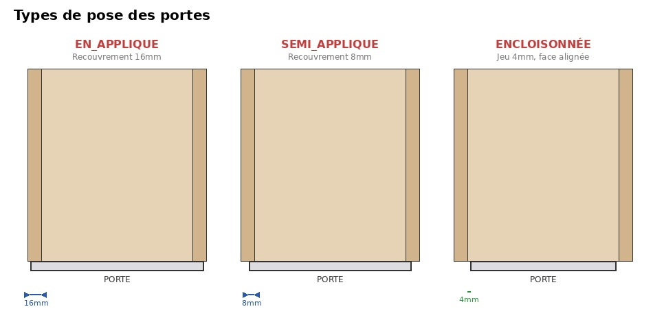
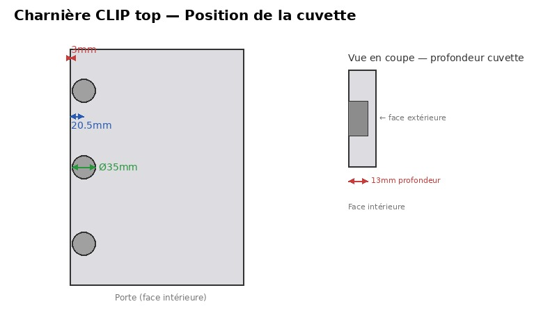
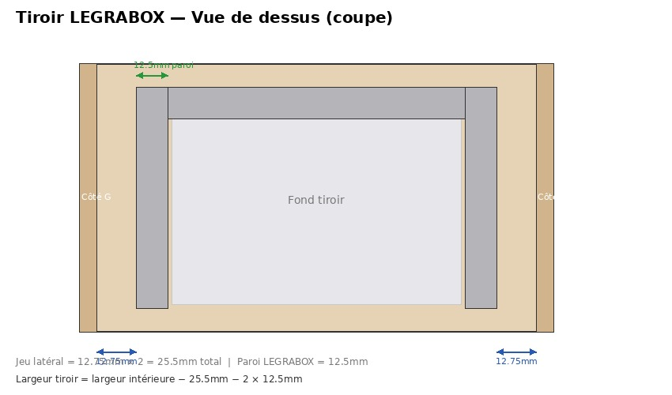

# Bibliothèque Meubles Paramétriques v5

## Notice d'utilisation — FreeCAD 1.0.2

---

## Table des matières

1. [Présentation générale](#1-présentation-générale)
2. [Installation et prérequis](#2-installation-et-prérequis)
3. [Architecture du script](#3-architecture-du-script)
4. [Construction étape par étape](#4-construction-étape-par-étape)
5. [Configuration du corps](#5-configuration-du-corps)
6. [Configuration du fond](#6-configuration-du-fond)
7. [Séparations et compartiments](#7-séparations-et-compartiments)
8. [Crémaillères](#8-crémaillères)
9. [Étagères sur crémaillères](#9-étagères-sur-crémaillères)
10. [Pieds et plinthes](#10-pieds-et-plinthes)
11. [Façades — Portes](#11-façades--portes)
12. [Façades — Tiroirs LEGRABOX](#12-façades--tiroirs-legrabox)
13. [Façades mixtes par compartiment](#13-façades-mixtes-par-compartiment)
14. [Nomenclature et export](#14-nomenclature-et-export)
15. [Fonctions raccourcis](#15-fonctions-raccourcis)
16. [Référence des paramètres](#16-référence-des-paramètres)

---

## 1. Présentation générale

Cette bibliothèque Python génère des meubles paramétriques dans FreeCAD. Elle produit un modèle 3D complet à partir de paramètres dimensionnels et de règles d'assemblage, incluant la quincaillerie Blum (charnières CLIP top, tiroirs LEGRABOX) et les usinages (rainures de fond, rainures de crémaillères).



| Axe | Direction | Repères |
|-----|-----------|---------|
| X | Profondeur | X=0 arrière (fond) → X=profondeur avant (façade) |
| Y | Largeur | Y=0 côté gauche → Y=largeur côté droit |
| Z | Hauteur | Z=0 sol → Z=hauteur_plinthe bas du corps → Z=hauteur haut |

---

## 2. Installation et prérequis

Le script s'exécute en tant que **macro FreeCAD**. Aucune installation supplémentaire n'est requise (sauf `openpyxl` pour l'export Excel).

1. Copier `meubles_parametriques_v5.py` dans le dossier des macros FreeCAD
   (typiquement `~/.FreeCAD/Macro/` ou `~/snap/freecad/common/`)
2. Ouvrir FreeCAD 1.0.2
3. Menu **Macro → Exécuter la macro** ou copier/coller dans la console Python

Pour l'export XLSX (optionnel) :
```bash
pip install openpyxl
```

---

## 3. Architecture du script

```
┌─────────────────────────────────────────────────────────────────┐
│                        CONFIGURATIONS                           │
│  ConfigFond  ConfigCremaillere  ConfigEtagere  ConfigPlinthe    │
│  ConfigSeparations  ReglesAssemblage                           │
├─────────────────────────────────────────────────────────────────┤
│                        QUINCAILLERIE                            │
│  LegraboxSpec  LegraboxHauteur  ClipTopSpec                    │
├─────────────────────────────────────────────────────────────────┤
│                        COMPOSANTS                               │
│  Materiau  Panneau  PanneauFond  SeparationVerticale           │
│  Compartiment  Porte  TiroirLegrabox                           │
├─────────────────────────────────────────────────────────────────┤
│                        MEUBLE                                   │
│  Meuble  (classe principale qui orchestre tout)                │
├─────────────────────────────────────────────────────────────────┤
│                        UTILITAIRES                              │
│  GestionnaireObjets  (création/mise à jour objets FreeCAD)     │
└─────────────────────────────────────────────────────────────────┘
```

Chaque exécution **met à jour** le modèle existant au lieu de créer des doublons.

---

## 4. Construction étape par étape

L'API est chaînable (fluent). L'ordre est obligatoire.

```python
regles = ReglesAssemblage.standard()
meuble = Meuble("MonMeuble", largeur=600, hauteur=720, profondeur=560, regles=regles)

meuble.ajouter_cotes()
meuble.ajouter_dessous(retrait=50)
meuble.ajouter_dessus(type="traverses")
meuble.ajouter_fond()
meuble.ajouter_separations()
meuble.ajouter_cremailleres()
meuble.ajouter_pieds_et_plinthes()
meuble.ajouter_etagere_compartiment(0, hauteur_depuis_bas=200)
meuble.ajouter_facades_compartiment(0, [("tiroir", LegraboxHauteur.K)])
meuble.construire()
meuble.exporter_nomenclature_xlsx("/chemin/nomenclature.xlsx")
```

```
   cotes ──► dessous ──► dessus ──► fond ──► séparations ──► crémaillères
                                                                   │
              construire() ◄── façades ◄── étagères ◄── plinthes ◄─┘
                   │
                   ▼
         exporter_nomenclature(_xlsx)
```

---

## 5. Configuration du corps



### Paramètres du constructeur `Meuble`

| Paramètre | Défaut | Description |
|-----------|--------|-------------|
| `nom` | — | Nom du document FreeCAD |
| `largeur` | — | Largeur totale (mm) |
| `hauteur` | — | Hauteur totale sol → dessus (mm) |
| `profondeur` | — | Profondeur arrière → avant façade (mm) |
| `epaisseur` | 19 | Épaisseur panneaux (mm) |
| `hauteur_plinthe` | 100 | Hauteur de la plinthe (mm) |
| `epaisseur_facade` | 19 | Épaisseur des façades (mm) |

### Formules clés

- `hauteur_corps` = hauteur − hauteur_plinthe
- `largeur_interieure` = largeur − 2 × épaisseur
- `profondeur_corps` = profondeur − épaisseur_facade

### Types d'assemblage (`TypeAssemblage`)

```
   DESSUS_ENTRE (défaut)                DESSUS_SUR
   ┌──┬────────────┬──┐                ┌──────────────┐
   │  │  dessus    │  │                │    dessus     │
   │  ├────────────┤  │                ├──┬────────┬──┤
   │  │   côté     │  │                │  │  côté  │  │
   │  ├────────────┤  │                ├──┴────────┴──┤
   │  │  dessous   │  │                │    dessous    │
   └──┴────────────┴──┘                └──────────────┘
```

### Types de dessus

```python
meuble.ajouter_dessus(type="plein")       # Panneau plein
meuble.ajouter_dessus(type="traverses")   # 2 traverses (avant 100mm + arrière 100mm)
```

---

## 6. Configuration du fond



### Paramètres `ConfigFond`

| Paramètre | Défaut | Description |
|-----------|--------|-------------|
| `type_assemblage` | RAINURE | RAINURE, VISSAGE ou APPLIQUE |
| `epaisseur` | 3.0 | Épaisseur du fond (mm) |
| `profondeur_rainure` | 8.0 | Profondeur de la rainure (mm) |
| `distance_rainure_chant` | 10.0 | Distance rainure / chant arrière |
| `hauteur_imposee` | None | Limiter la hauteur du fond (mm) |

### Exemples

```python
ConfigFond.standard_rainure()
ConfigFond.standard_vissage()
ConfigFond(epaisseur=5).avec_vissage().avec_decalage(5)
ConfigFond.standard_rainure().avec_hauteur_imposee(400, position="centre")
```

---

## 7. Séparations et compartiments



### Paramètres `ConfigSeparations`

| Paramètre | Défaut | Description |
|-----------|--------|-------------|
| `nombre_compartiments` | 1 | Nombre de compartiments |
| `largeurs_compartiments` | None | Largeurs personnalisées |
| `epaisseur` | 19 | Épaisseur séparations (mm) |

### Calcul (compartiments égaux)

```
largeur_intérieure = largeur − 2 × épaisseur
largeur_disponible = largeur_intérieure − (nb_compartiments − 1) × ép_séparation
largeur_compartiment = largeur_disponible / nb_compartiments
```

### Exemples

```python
ConfigSeparations(nombre_compartiments=3)
ConfigSeparations.trois_compartiments()
ConfigSeparations().avec_largeurs([300, 500, 324])
```

---

## 8. Crémaillères



Rainures 16 × 7mm dans les côtés et les deux faces des séparations.

### Paramètres `ConfigCremaillere`

| Paramètre | Défaut | Description |
|-----------|--------|-------------|
| `largeur` | 16.0 | Largeur profilé (mm) |
| `profondeur` | 7.0 | Profondeur encastrement (mm) |
| `distance_avant` | 37.0 | Distance depuis l'avant (mm) |
| `distance_arriere` | 37.0 | Distance depuis l'arrière (mm) |
| `double` | True | 2 crémaillères par panneau |

---

## 9. Étagères sur crémaillères

### Paramètres `ConfigEtagere`

| Paramètre | Défaut | Description |
|-----------|--------|-------------|
| `jeu_lateral` | 1.0 | Jeu côtés (mm) |
| `jeu_arriere` | 5.0 | Jeu fond (mm) |
| `retrait_avant` | 20.0 | Retrait avant (mm) |
| `chant_avant` | True | Chant face avant |

### Exemples

```python
meuble.ajouter_etagere_compartiment(0, hauteur_depuis_bas=200)
meuble.ajouter_etageres_compartiment(0, hauteurs=[150, 300, 450])
```

---

## 10. Pieds et plinthes


La plinthe avant passe **devant** les plinthes latérales (coupes droites).

### Paramètres `ConfigPlinthe`

| Paramètre | Défaut | Description |
|-----------|--------|-------------|
| `hauteur` | 100.0 | Hauteur plinthe (mm) |
| `epaisseur` | 16.0 | Épaisseur plinthe (mm) |
| `retrait` | 30.0 | Retrait avant / façade (mm) |
| `retrait_lateral` | 16.0 | Retrait latéral / côté (mm) |
| `cotes` | ["avant"] | "avant", "gauche", "droite" |
| `nombre_pieds_profondeur` | 2 | Pieds en profondeur |
| `nombre_pieds_largeur` | 2 | Pieds en largeur |

### Préréglages

```python
ConfigPlinthe.avant_seul()       # 1 côté
ConfigPlinthe.trois_cotes()      # 3 côtés
ConfigPlinthe.en_l_gauche()      # Avant + gauche
ConfigPlinthe.en_l_droite()      # Avant + droite
```

---

## 11. Façades — Portes



### Types de pose (`TypePose`)

| Type | Recouvrement | Position |
|------|-------------|----------|
| `EN_APPLIQUE` | 16mm | Plaquée sur face avant |
| `SEMI_APPLIQUE` | 8mm | Plaquée sur face avant |
| `ENCLOISONNEE` | jeu 4mm | Face alignée avec le corps |

### Cuvette charnière



- Bord cuvette → bord porte : **3mm** (constant)
- Centre cuvette → bord porte : **20.5mm** (constant)
- Diamètre cuvette : **Ø35mm**, profondeur **13mm**

### Jeux

| Paramètre | Valeur |
|-----------|--------|
| `jeu_porte_haut` | 4mm |
| `jeu_porte_bas` | 4mm |
| `jeu_porte_lateral` | 2mm |
| `jeu_entre_portes` | 4mm |

### Portes par compartiment

```python
# Auto (alternance G/D)
meuble.ajouter_portes_compartiments()

# Choix explicite
meuble.ajouter_portes_compartiments([
    (0, TypeOuverture.GAUCHE),
    (1, TypeOuverture.DROITE),
    (2, TypeOuverture.GAUCHE),
])
```

Recouvrement sur séparations : chaque porte recouvre **la moitié** de la séparation.

---

## 12. Façades — Tiroirs LEGRABOX



### Hauteurs de côtés

| Réf | Hauteur paroi |
|-----|--------------|
| M | 90.5 mm |
| K | 128.5 mm |
| C | 193.0 mm |
| F | 257.0 mm |

### Tiroirs par compartiment

```python
meuble.ajouter_tiroirs_legrabox(3, index_compartiment=0)
meuble.ajouter_tiroirs_legrabox(4, index_compartiment=1, hauteur_cote=LegraboxHauteur.K)
```

Hauteur des façades = automatique (remplit l'espace). Jeu entre façades = **4mm**.

---

## 13. Façades mixtes par compartiment


### Syntaxe des tuples

| Façade | Tuple |
|--------|-------|
| Tiroir auto | `("tiroir", LegraboxHauteur.K)` |
| Tiroir imposé | `("tiroir", LegraboxHauteur.K, 200)` |
| Porte auto | `("porte", TypeOuverture.GAUCHE)` |
| Porte imposée | `("porte", TypeOuverture.DROITE, 400)` |

Les façades **sans hauteur imposée** se répartissent équitablement dans l'espace restant.

### Exemples

```python
# Comp. 0 : 3 tiroirs
meuble.ajouter_facades_compartiment(0, [
    ("tiroir", LegraboxHauteur.F),
    ("tiroir", LegraboxHauteur.F),
    ("tiroir", LegraboxHauteur.K),
])

# Comp. 1 : tiroir + porte
meuble.ajouter_facades_compartiment(1, [
    ("tiroir", LegraboxHauteur.K),
    ("porte", TypeOuverture.DROITE),
])

# Comp. 2 : porte seule
meuble.ajouter_portes_compartiments([(2, TypeOuverture.GAUCHE)])
```

### Les 3 méthodes de façades

| Méthode | Usage |
|---------|-------|
| `ajouter_portes_compartiments(portes)` | 1 porte/compartiment |
| `ajouter_tiroirs_legrabox(n, index)` | N tiroirs identiques |
| `ajouter_facades_compartiment(index, facades)` | Mix portes + tiroirs |

---

## 14. Nomenclature et export

### Fichier texte

```python
meuble.exporter_nomenclature("/chemin/nomenclature.txt")
```

### Fichier Excel (.xlsx)

```python
meuble.exporter_nomenclature_xlsx("/chemin/nomenclature.xlsx")
```

5 onglets : **Panneaux** (fiche de débit, surfaces, chants) · **Portes** (dimensions, charnières) · **Tiroirs** (façade, coulisse, hauteur) · **Plinthes** (dimensions, pieds) · **Résumé** (totaux).

### Console

```python
print(meuble.generer_nomenclature())
```

---

## 15. Fonctions raccourcis

```python
m = meuble_bas_porte("Cuisine", largeur=600, fond_rainure=True, double=True)
m = meuble_bas_tiroirs("Tiroirs", largeur=600, nombre_tiroirs=3, hauteur_legrabox=LegraboxHauteur.M)
```

---

## 16. Référence des paramètres

```python
regles = ReglesAssemblage.standard()
regles.type_assemblage = TypeAssemblage.DESSUS_ENTRE
regles.type_pose = TypePose.EN_APPLIQUE
regles.jeu_porte_haut = 4
regles.jeu_porte_bas = 4
regles.jeu_porte_lateral = 2
regles.jeu_entre_portes = 4
regles.jeu_entre_tiroirs = 4
regles.legrabox_hauteur = LegraboxHauteur.M

regles.configurer_fond(ConfigFond.standard_rainure())
regles.configurer_separations(ConfigSeparations.trois_compartiments())
regles.configurer_cremailleres(ConfigCremaillere.standard())
regles.configurer_etageres(ConfigEtagere.standard())
regles.configurer_plinthe(ConfigPlinthe.trois_cotes())
regles.configurer_pose(TypePose.EN_APPLIQUE)
```
